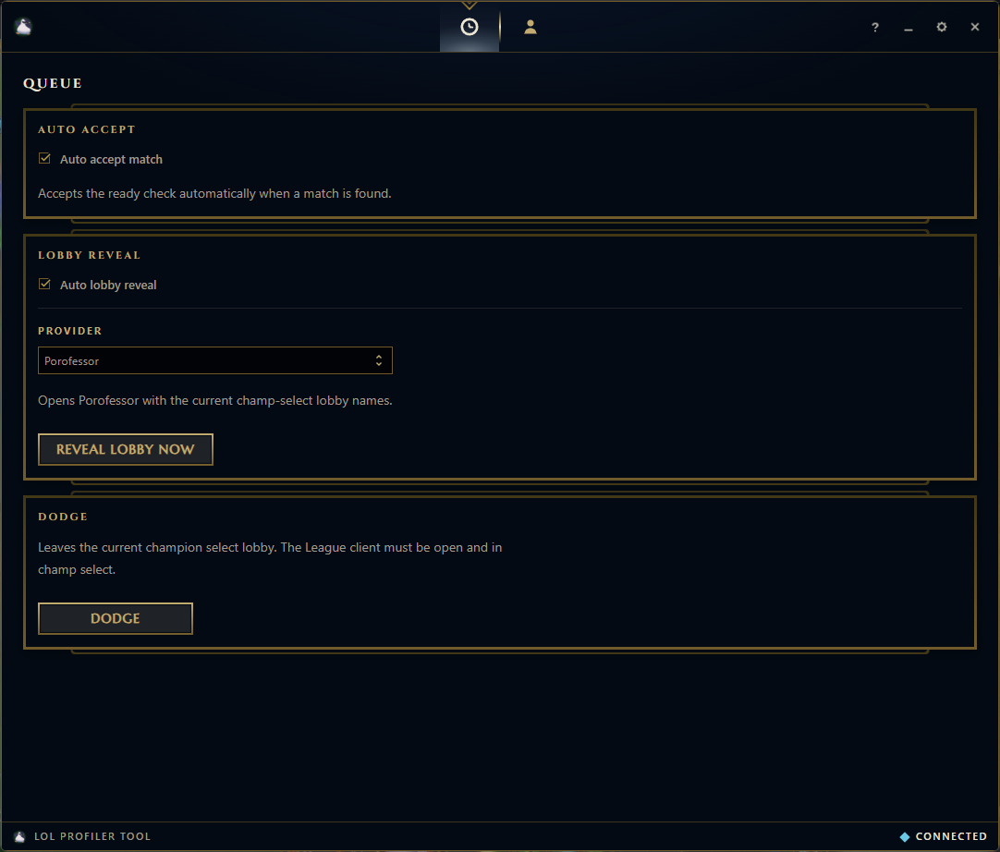
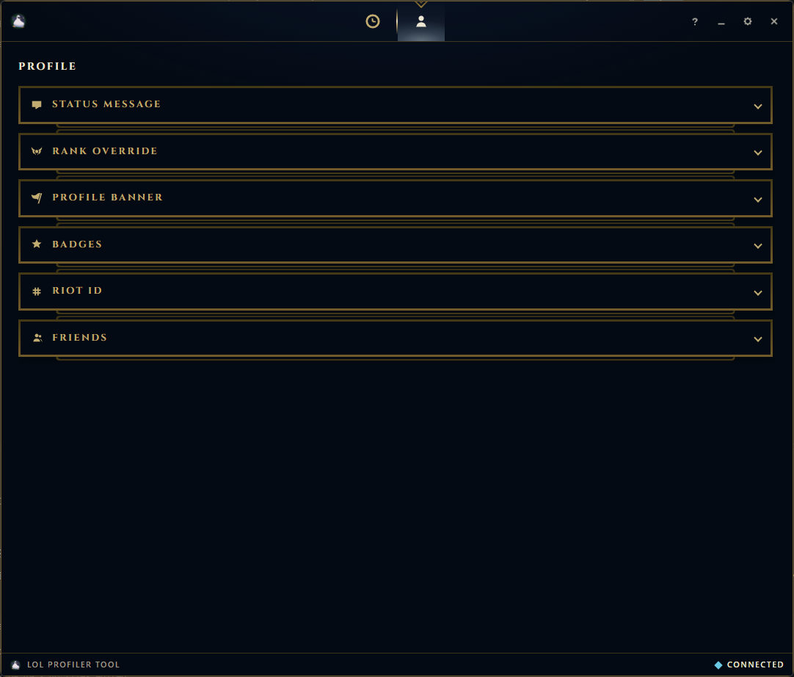
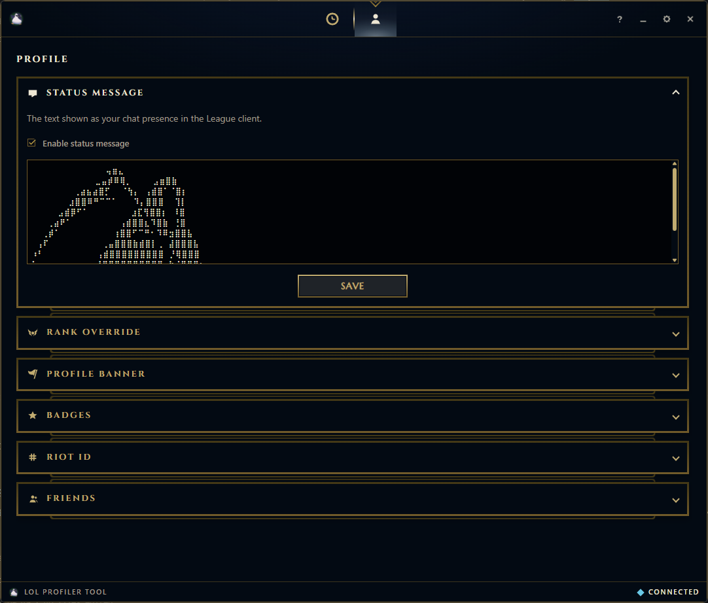
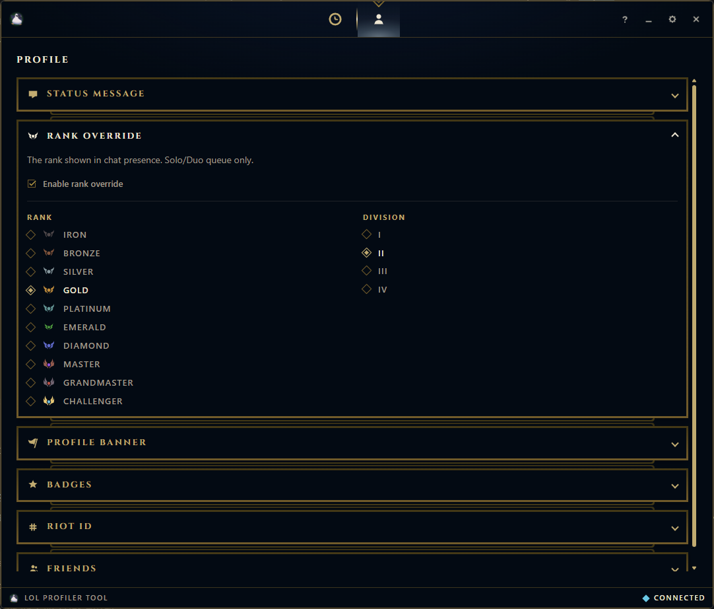
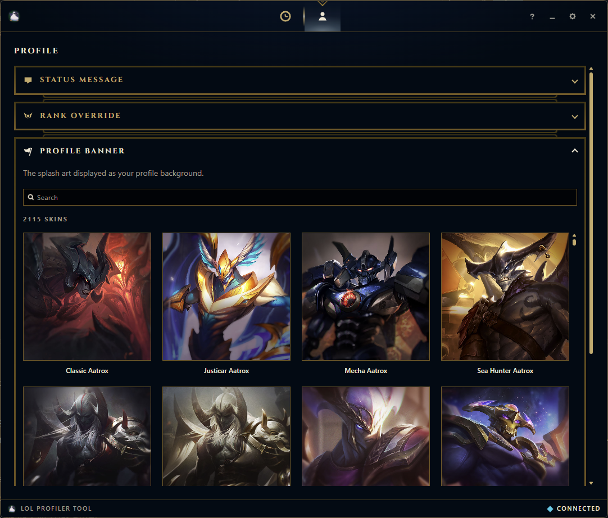

# LoL Profiler Tool

Windows app to customize your League of Legends profile from outside the client. Queue helpers on one tab, profile stuff on the other.

Unofficial. Not affiliated with Riot Games.

The app lives in the system tray. Closing the window only hides it. Right click the tray icon and choose Quit to close it for real.

## Queue

Auto accept, lobby reveal (Porofessor or OP.GG), and dodge.



## Profile

Status, rank card, banner, badges, Riot ID, and friends.



Status message (ASCII art works):



Rank shown in chat:



Profile banner:



and much more...

## Install

Download the installer from [Releases](https://github.com/sluucke/lol-profiler-tool/releases/latest).

## Development

Needs Node.js, Rust, and the [Tauri prerequisites](https://v2.tauri.app/start/prerequisites/).

```bash
npm install
npm run tauri dev
```

Installer build:

```bash
npm run tauri build
```

Output: `src-tauri/target/release/bundle/nsis/`

## Legacy v1

The old Python app is in [`legacy/`](legacy/).

## Contributing

See [CONTRIBUTING.md](CONTRIBUTING.md).

## License

[MIT](LICENSE) © David William
